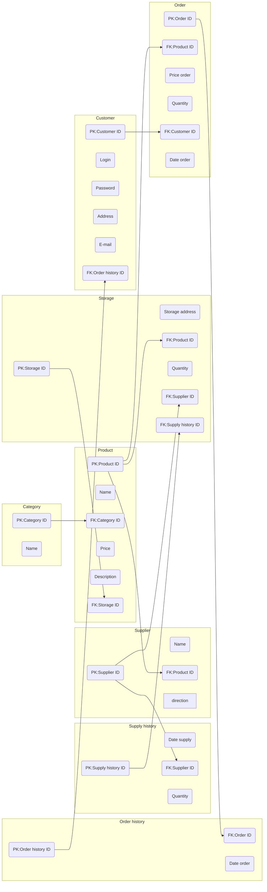

```mermaid


flowchart LR
subgraph "Product"

    1(PK:Product ID)
    2(Name)
    3(FK:Сategory ID)
    4(Price)
    5(Description)
    6(FK:Storage ID)
end


subgraph "Customer"
 
    7(PK:Customer ID)
    8(Login)
    9(Password)
    10(Address)
    11(E-mail)
    12(FK:Order history ID)
end


subgraph "Order"

    13(PK:Order ID)
    14(FK:Product ID )
    15(Price order)
    16(Quantity)
    17(FK:Customer ID)
    18(Date order)
end

subgraph "Storage"

    19(PK:Storage ID)
    20(Storage address)
    21(FK:Product ID)
    22(Quantity)
    23(FK:Supplier ID)
    27(FK:Supply history ID)
end
subgraph "Supplier"
direction 
    24(PK:Supplier ID)
    25(Name)
    26(FK:Product ID)
    
end
subgraph "Category"

    28(PK:Category ID)
    29(Name)
end

subgraph "Order history"

    30(PK:Order history ID)
    31(FK:Order ID)
    32(Date order)
end

subgraph "Supply history"
direction LR
    33(PK:Supply history ID)
    34(Date supply)
    35(FK:Supplier ID)
    36(Quantity)

end

7-->17; 28-->3; 1-->21; 19-->6; 24-->23; 1-->14; 1-->26; 30-->12; 13-->31; 24-->35; 33-->27


```
