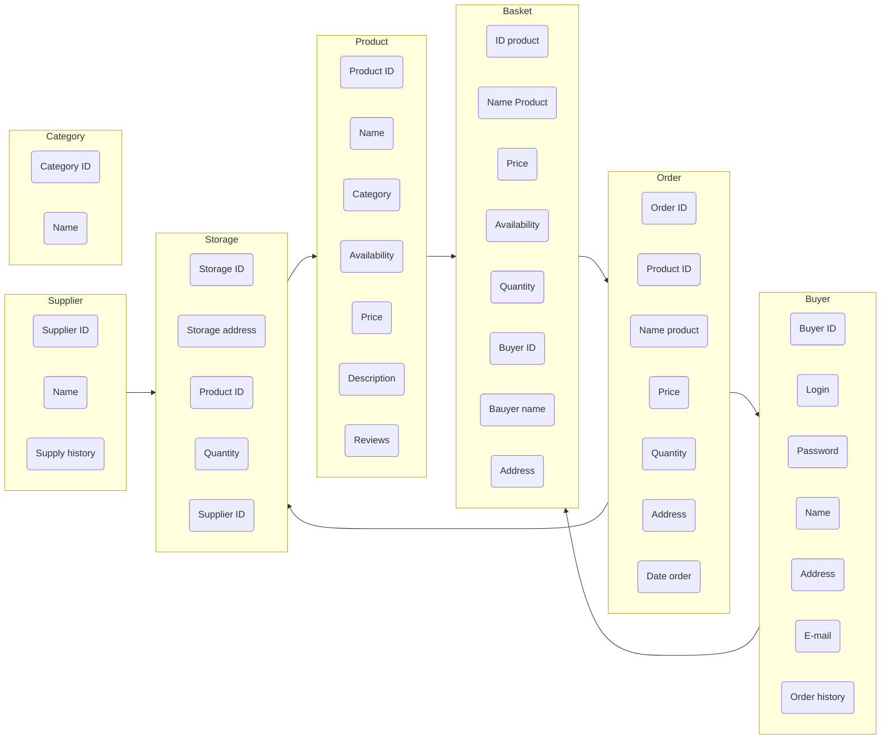

```mermaid


flowchart LR
subgraph "Product"
direction  LR
    1(Product ID)
    2(Name)
    3(Сategory)
    4(Availability)
    5(Price)
    6(Description)
    7(Reviews)
end

subgraph "Buyer"
direction LR
    8(Buyer ID)
    9(Login)
    10(Password)
    11(Name)
    12(Address)
    13(E-mail)
    14(Order history)
end

subgraph "Basket"
direction LR
    15(ID product)
    16(Name Product)
    17(Price)
    18(Availability)
    19(Quantity)
    20(Buyer ID)
    21(Bauyer name)
    22(Address)
end

subgraph "Order"
direction LR
    23(Order ID)
    24(Product ID )
    25(Name product)
    26(Price)
    27(Quantity)
    28(Address)
    29(Date order)
end

subgraph "Storage"
direction LR
    30(Storage ID)
    31(Storage address)
    32(Product ID)
    33(Quantity)
    34(Supplier ID)
end
subgraph "Supplier"
direction LR
    35(Supplier ID)
    36(Name)
    37(Supply history)
end
subgraph "Сategory"
direction LR
    38(Category ID)
    39(Name)
end

Product-->Basket
Buyer-->Basket
Order-->Buyer
Basket-->Order
Storage-->Product
Supplier-->Storage
Order-->Storage
```
